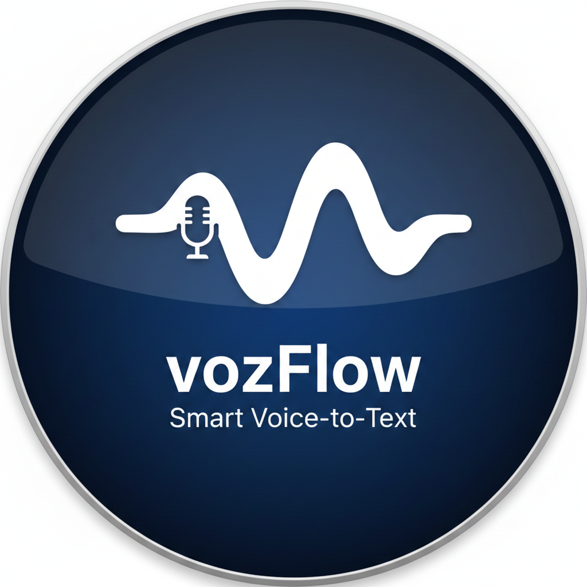

<p align="center">
  
</p>

<h1 align="center">Voz Flow</h1>
<p align="center"><strong>Smart Voice-to-Text for macOS</strong></p>
<p align="center">Dicta con tu voz en cualquier chat. Sin escribir. Sin copiar. Sin pegar.</p>

<p align="center">
  
  
  
  
</p>

---

## Como funciona

```
 Pulsa Cmd+Option+R        Habla                   Se pega solo
 en cualquier app     ->   lo que quieras     ->   en el chat activo
      (1)                     (2)                      (3)
```

**Voz Flow** vive en tu barra de menu. Cuando pulsas el atajo, aparece una barra de audio minimalista, transcribe tu voz con IA, y pega el texto directamente en la app donde estabas (WhatsApp, Telegram, Slack, Chrome, cualquiera).

### Flujo visual

```
+-----------------+     +------------------+     +------------------+
|  Estas en un    |     |  Pill flotante   |     |  Texto pegado    |
|  chat cualquiera| --> |  muestra audio   | --> |  automaticamente |
|  Cmd+Option+R   |     |  mientras hablas  |     |  en tu chat      |
+-----------------+     +------------------+     +------------------+
```

---

## Caracteristicas

| Funcionalidad | Descripcion |
|---|---|
| **Dictado universal** | Funciona en cualquier app de macOS — WhatsApp, Telegram, Slack, Chrome, etc. |
| **Atajo global** | `Cmd+Option+R` para empezar/parar. Tambien soporta double-tap Ctrl. |
| **Pill flotante** | Barra de audio compacta con tu logo, visualizacion en tiempo real. |
| **IA de transcripcion** | Groq Whisper v3 — rapido, preciso, multilingue. |
| **Limpieza inteligente** | Quita muletillas (eh, um, mmm) y pone puntuacion. Respeta tus palabras exactas. |
| **Auto-paste** | El texto se pega solo en la app donde estabas. Sin Cmd+V manual. |
| **Historial local** | SQLite local con busqueda full-text. Tus transcripciones no salen de tu Mac. |
| **Silencioso** | Arranca en el tray, sin ventana. No distrae. |
| **Auto-inicio** | Opcion para arrancar con macOS desde el menu del tray. |

---

## Arquitectura

```
+------------------------------------------------------------------+
|                        Electron Main Process                      |
|                                                                    |
|  +------------------+  +------------------+  +------------------+  |
|  |  Global Shortcut |  |  uiohook-napi    |  |  State Machine   |  |
|  |  Cmd+Option+R    |  |  Double-tap Ctrl |  |  IDLE -> REC ->  |  |
|  +--------+---------+  +--------+---------+  |  PROC -> DONE    |  |
|           |                      |            +--------+---------+  |
|           +----------+-----------+                     |            |
|                      |                                 |            |
|           +----------v-----------+          +----------v---------+  |
|           |  captureFrontmostApp |          |  Pill Window       |  |
|           |  (AppleScript)       |          |  Audio visualizer  |  |
|           +----------------------+          |  Canvas + physics  |  |
|                                             +--------------------+  |
+---------------------------+--------------------------------------+
                            |
                            | IPC
                            |
+---------------------------v--------------------------------------+
|                     Next.js Renderer                              |
|                                                                    |
|  +------------------+  +------------------+  +------------------+  |
|  |  MediaRecorder   |  |  processAudio()  |  |  Dashboard UI    |  |
|  |  WebM/Opus       |->|  Groq Whisper    |->|  History, Config |  |
|  |  Noise suppress  |  |  Llama refine    |  |  Shortcuts       |  |
|  +------------------+  +--------+---------+  +------------------+  |
|                                 |                                  |
+---------------------------+-----+----------------------------------+
                            |
                            | IPC: type-text
                            |
+---------------------------v--------------------------------------+
|                      Paste Pipeline                               |
|                                                                    |
|  1. pbcopy (clipboard)                                            |
|  2. open -b <bundle> (activate target app)                        |
|  3. keystroke "v" using {command down}                             |
|  4. Retry on failure                                              |
+------------------------------------------------------------------+
```

---

## Requisitos

- **macOS** 12+ (Monterey o superior)
- **Node.js** 18+
- **API Key de Groq** (gratis en [console.groq.com](https://console.groq.com/keys))

### Permisos de macOS

La app necesita estos permisos en **Preferencias del Sistema > Privacidad y Seguridad**:

| Permiso | Para que |
|---|---|
| **Microfono** | Capturar tu voz |
| **Accesibilidad** | Enviar Cmd+V a otras apps |
| **Automatizacion** | Activar la app de destino |

---

## Instalacion

### Opcion 1: App compilada (recomendado para uso diario)

```bash
# Clonar el repo
git clone https://github.com/tu-usuario/voz-flow.git
cd voz-flow

# Instalar dependencias
npm install

# Configurar API key
cp .env.example .env.local
# Editar .env.local y agregar tu GROQ_API_KEY

# Compilar la app
npm run app

# La app se genera en dist/Voz Flow.app
# Arrastrala a /Aplicaciones
```

Despues de instalar, activa **"Abrir al iniciar sesion"** desde el icono del tray para que arranque sola.

### Opcion 2: Modo desarrollo

```bash
npm install
npm run electron-dev
```

---

## Configuracion

### API Key de Groq

1. Ve a [console.groq.com/keys](https://console.groq.com/keys)
2. Crea una API key gratuita
3. En la app, click en el tray > abre el dashboard > Configuracion > pega la key

O en `.env.local`:
```
GROQ_API_KEY=gsk_tu_api_key_aqui
```

### Atajos de teclado

| Atajo | Accion |
|---|---|
| `Cmd+Option+R` | Empezar/parar grabacion (default) |
| `Ctrl+Ctrl` | Double-tap Control (alternativo) |

El atajo se puede personalizar desde el dashboard.

---

## Uso

1. **Abre cualquier chat** (WhatsApp, Telegram, Slack, etc.)
2. **Pulsa `Cmd+Option+R`**
3. **Habla** — veras la pill con la visualizacion de audio
4. **Pulsa `Cmd+Option+R` otra vez** para parar
5. **El texto se pega solo** en el chat donde estabas

```
Tu dices:                          Se pega:
"eh bueno queria decirte que       "Queria decirte que manana
manana no puedo ir a la            no puedo ir a la reunion,
reunion mmm porque tengo           porque tengo medico."
medico"
```

---

## Stack tecnico

| Capa | Tecnologia |
|---|---|
| **Desktop** | Electron 34 |
| **Frontend** | Next.js 16, React 19, TypeScript |
| **UI** | Tailwind CSS 4, shadcn/ui, Framer Motion |
| **Transcripcion** | Groq Whisper v3 (API) |
| **Refinamiento** | Groq Llama 3.3 70B |
| **Audio capture** | WebM/Opus via MediaRecorder API |
| **Keyboard** | globalShortcut + uiohook-napi |
| **Database** | SQLite (better-sqlite3) local |
| **State** | Zustand |
| **Paste** | AppleScript (pbcopy + keystroke) |

---

## Estructura del proyecto

```
voz-flow/
├── electron/
│   ├── main.js           # Proceso principal, IPC, paste, shortcuts
│   ├── preload.js         # Bridge seguro renderer <-> main
│   ├── pill.html          # UI de la pill flotante (canvas)
│   ├── pill-preload.js    # Bridge para la pill
│   ├── pill-logo.png      # Logo en la pill
│   └── database.js        # SQLite local
├── src/
│   ├── app/
│   │   ├── dashboard/
│   │   │   └── page.tsx   # Dashboard principal
│   │   └── api/
│   │       └── transcribe/
│   │           └── route.ts  # API fallback (modo web)
│   └── components/
│       ├── TranscriptionHistory.tsx
│       └── VoiceRecorder.tsx
├── public/
│   ├── icon.png           # Icono de la app
│   └── tray-icon.png      # Icono del tray
├── scripts/
│   └── build-electron.js  # Build script
└── package.json
```

---

## Scripts

| Comando | Descripcion |
|---|---|
| `npm run electron-dev` | Desarrollo con hot-reload |
| `npm run app` | Compilar .app y abrir |
| `npm run app:open` | Abrir .app ya compilada |
| `npm run dev` | Solo Next.js (sin Electron) |
| `npm run test` | Tests con Vitest |
| `npm run lint` | ESLint |

---

## Privacidad

- El audio se procesa via **Groq API** (no se almacena en sus servidores segun su politica)
- Las transcripciones se guardan **solo localmente** en SQLite en tu Mac
- No hay telemetria, no hay tracking, no hay cuentas obligatorias
- Tu voz nunca sale de tu Mac excepto para la transcripcion via API

---

## Troubleshooting

| Problema | Solucion |
|---|---|
| No se pega en el chat | Revisa permisos de Accesibilidad y Automatizacion en Preferencias del Sistema |
| No transcribe bien | Verifica que tu GROQ_API_KEY es valida en console.groq.com |
| Error 403 de Groq | Tu region puede estar bloqueada. Prueba sin VPN o genera nueva API key |
| La pill no aparece | Reinicia la app. Verifica que el atajo esta registrado en el dashboard |
| Audio no se captura | Permite acceso al microfono en Preferencias del Sistema |

---

## Licencia

MIT

---

<p align="center">
  <strong>Deja de escribir. Empieza a hablar.</strong>
</p>
